# Geospatial task

Tim Williams


This document provides a summary of the analysis and outputs contained within this Git repository. The _interpretation_ of the outputs is intentionally brief and relatively superficial, since my understanding is that this exercise aims to test coding and analysis skills, rather than my capacity to critically discuss results.

## Contents of the repository
- `code/` contains the main script `process_data.R` used to conduct all analysis
- `data/` contains the raw datasets (soil, landcover, biophysical) as well as the generated shapefile of the region used for the analysis
- `docs/` contains the challenge description
- `outputs/` contains generated raster files and plots (which are also reproduced in this README document)

## Data and methods
### Region selection
I conduct the analysis for the North Island of New Zealand. This is my homeplace. In terms of agriculture, a substantial proportion of the land is used for livestock production (e.g., extensive sheep and beef), with some fruit and wine production in lowland areas. If you are familiar with Lord of The Rings, you can picture Hobbiton.

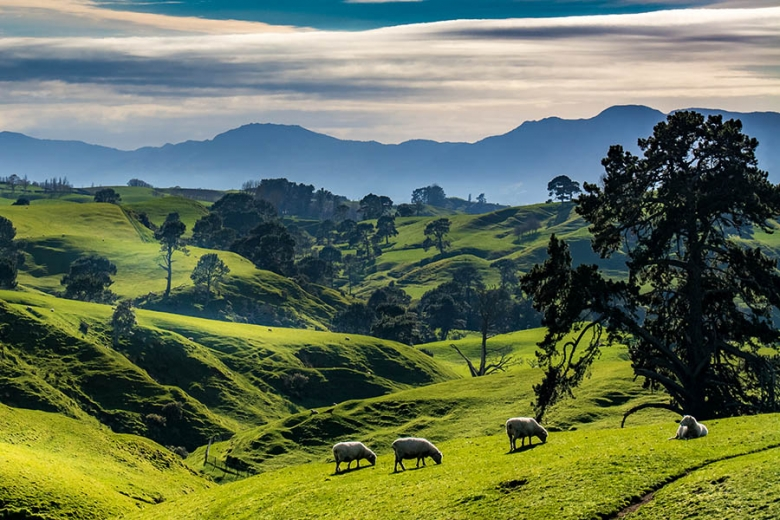

### Data downloads and pre-processing

Biophysical data were downloaded from [Copernicus](https://cds.climate.copernicus.eu/cdsapp#!/dataset/reanalysis-era5-single-levels-monthly-means?tab=form). I accessed the API through a python script (`code/download_ERA5.py`) to extract the following variables:
* Total precipitation (m/day) (`tp`) - I converted this to mm/day.
* Total evaporation (m/day) (`e`) - [Online documentation](https://confluence.ecmwf.int/display/CKB/ERA5-Land%3A+data+documentation#ERA5Land:datadocumentation-Guidelines) suggests that this is the appropriate variable to measure actual evapotranspiration. I also converted this to mm/day.
* 2m temperature (K) (`t2m`). I converted this to degrees Celsius.

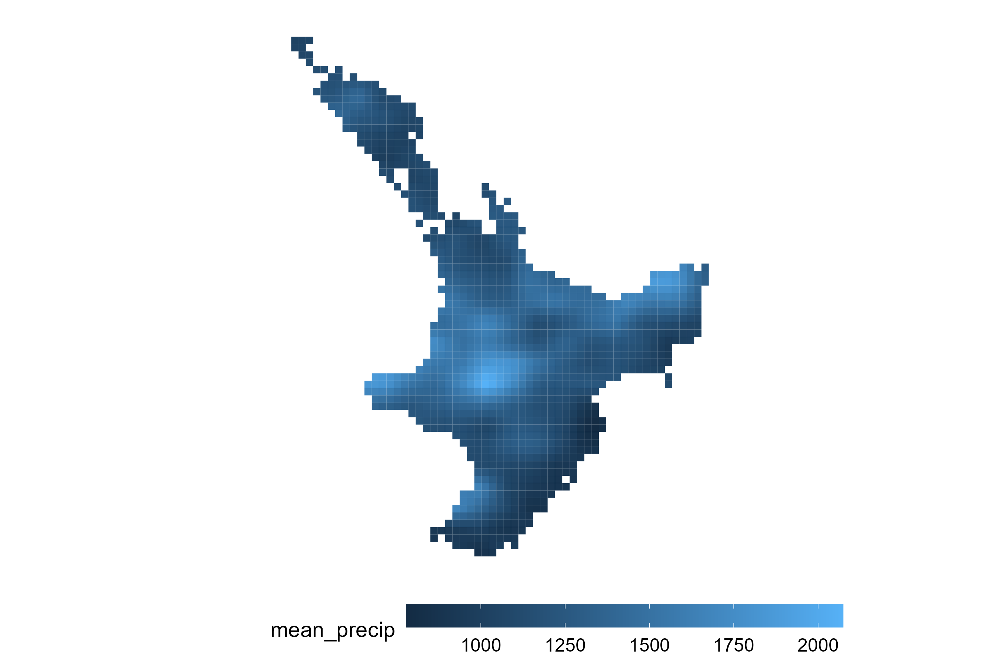

Landcover data were also downloaded from [Copernicus](https://cds.climate.copernicus.eu/cdsapp#!/dataset/satellite-land-cover?tab=form). I downloaded the 2020 landcover. As the map below shows (which is filtered to the 12 dominant landcover categories - non-intuitive colours sorry), there is actually very limited arable agriculture in the North Island (most is grassland and forest), so an important consideration here would be to shift to regenerative grazing systems (or transitions from livestock to arable agriculture) as well as regenerative forestry practices.

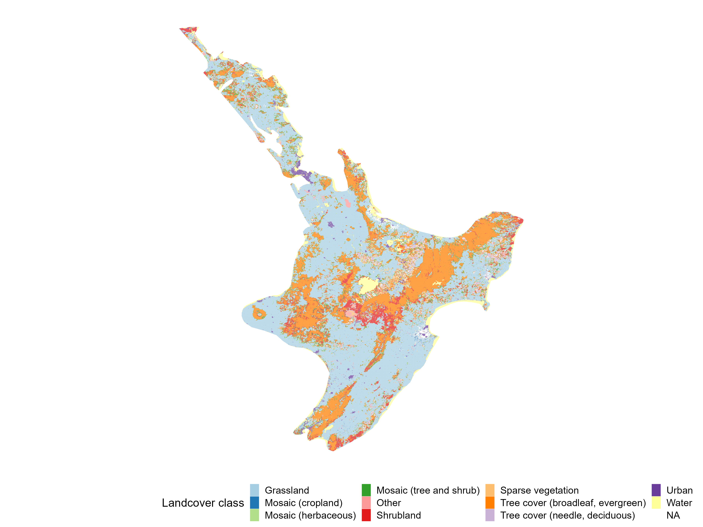

Soil data were downloaded from https://soilgrids.org/. I manually downloaded the required 2x2 degree patches and then combined them into a single raster in R (function `merge_soilgrids_tifs()`). SOC is generally highest in the forest regions. There was no timeseries data for soils.

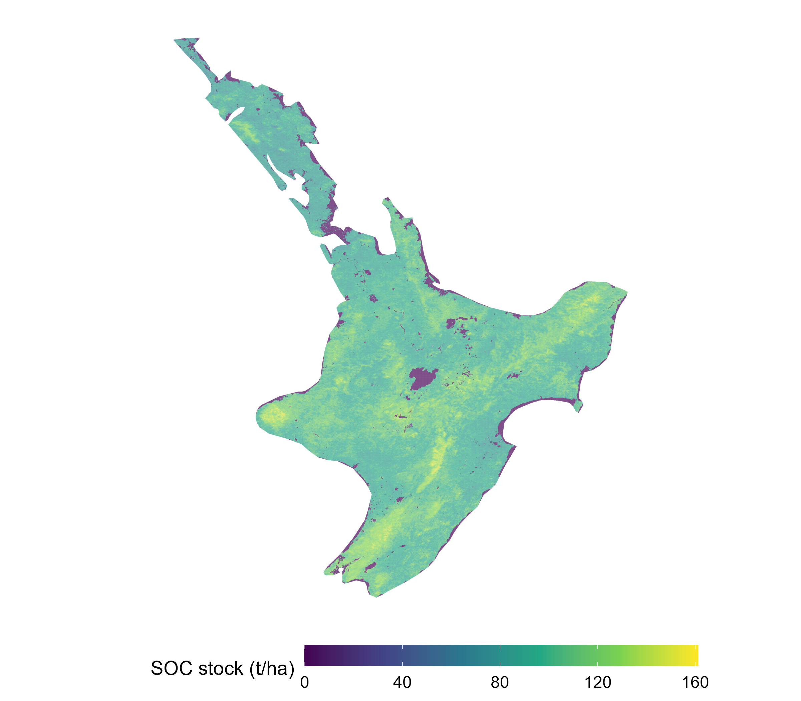

### Aligning the datasets
The climatic data (rainfall, temperature, evapotranspiration) are at the lowest resolution, so I resampled the soil and landcover data up to this resolution (using the `resample()` function from the `terra` package in R). 

As the landcover data are categorical, I calculated the _most common_ landcover class within each aggregated pixel. With more time, it would be possible to also calculate the fraction of each landcover category in each aggregated pixel, which would facilitate more precise analysis.

### Analysis and visualisation
To faciliate plotting and (non-spatial) analysis of the spatial data, I converted the rasters into "long" data.frame formats. I created a separate data.frame for the temporal data (climatic) and static data (soil and landcover).
For example, the climatic data was stored as follows:

| pixel_id | variable | value | year| 
| ------- | ------- | ------- | ------- |
| 1 | t2m |  18.596370 |  2000.000 | 
| 2 | t2m |  18.610992 |  2000.000 | 
| ... | ... |  ... |  ... | 
| 4088 | tp | 1.334241 | 2022.917 |

This allows using functions such as `group_by()` from the `dplyr` package for data manipulation.
It also better links with `ggplot`, which I used to generate all plots and maps.

## Results
### Timeseries of biophysical variables
As there was no timeseries data for the SOC, I was only able to analyse timeseries of the biophysical variables. Here, I filtered to the four dominant landcover classes: grassland, shrubland, treecover (broadleaf, evergreen), and treecover (needle, deciduous). These reflect the North Island's dominant pastoral sector, as well as forestry (mainly pine plantations), native bush, and alpine shrublands.

New Zealand has a coastal climate, so temperature does not vary dramatically - typically between 5 and 20 degrees celsius. We see that the land with tree cover typically has slightly lower temperatures. The monthly precipitation data is, unexpectedly, more erratic and difficult to comprehend in this way.

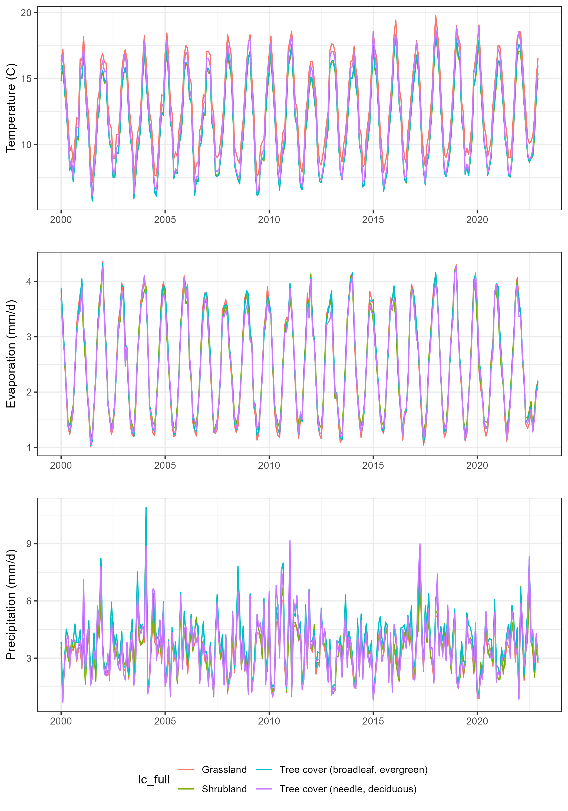

We can instead calculate a 1-year rolling average of precipitation (i.e., the sum of the precipitation over the past 12 months), and can now see that precipitation is generally higher in forested landscapes than grassland or shrubland.

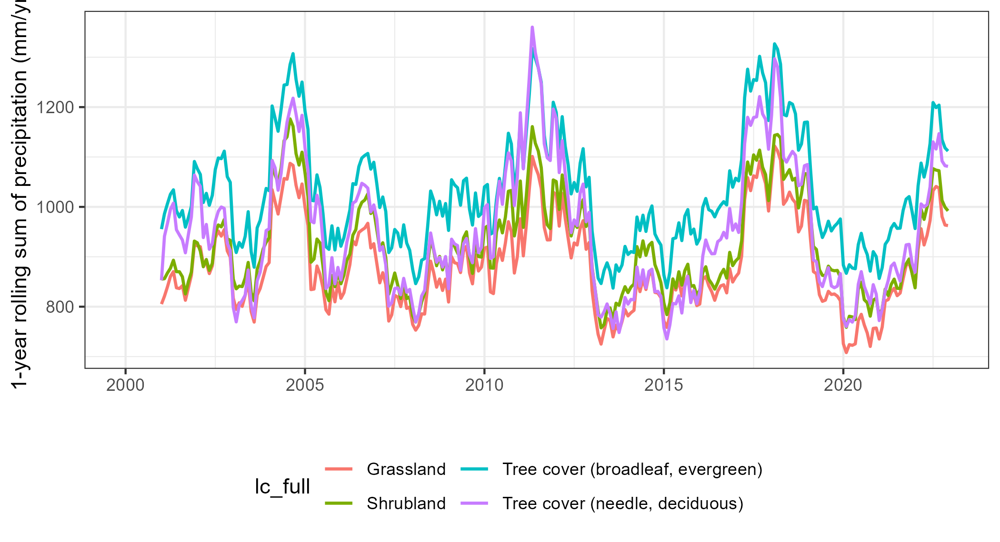

### Soil organic carbon in each landcover category
Again filtering to the four dominant landcover categories, we see that each contains a somewhat distinct distribution of SOC, with lower values on average in grassland and deciduous needle-leaved treecover. Without digging into it further, I am unsure what kinds of trees these represent, since pine trees are the dominant needle-leaved trees in New Zealand but are evergreen.

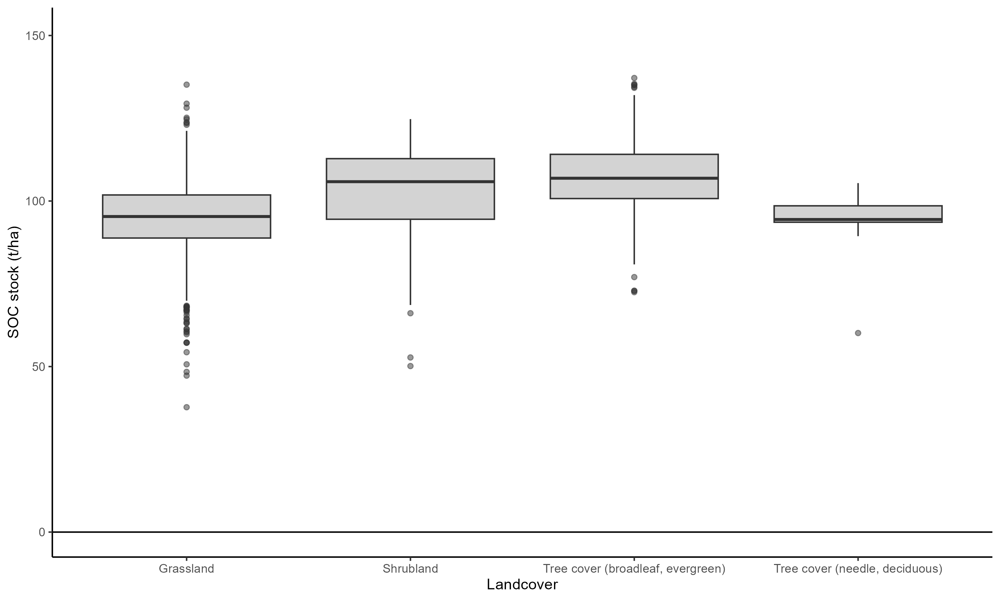

### Sampling design
I found this question somewhat difficult to interpret, but since the stated goal is to detect _**changes**_ in SOC due to management conditions, I conducted a power analysis. This analysis calculates the required sample sizes to detect differences in SOC between treatment fields (e.g., with regenerative agriculture practices) and control fields (i.e., under baseline management conditions).

I must make two assumptions for this analysis. 
1. This one relates to my difficulty understanding the question, but I am assuming that we expect the regenerative agriculture practices to increase the SOC by around 10%. This draws from the "10% of the mean value" text in the question. I believe this is not exactly what was intended, but it is the assumption I proceed with. I note that it could have been possible to calculate required sample sizes using the methods described [here](https://sphweb.bumc.bu.edu/otlt/mph-modules/bs/bs704_power/bs704_power_print.html) (i.e., $n^*=(Z\sigma/E)^2$, where E is the margin of error), but I ultimately feel this is less appropriate in our particular context, where we want to find evidence of changes in the distribution of SOC.

2. I assume a power level of 0.8, which is the typically assumed value ([ref](https://meera.seas.umich.edu/power-analysis-statistical-significance-effect-size.html#:~:text=In%20other%20words%2C%20power%20is,difference%20when%20there%20is%20one.)). This means we have an 80% chance of finding a statistically significant difference between treatment/control if there is one.

The following R code first calculates the Cohen's d value, which is a standardised measure of the effect size - in this case, 10% of the mean value divided by the standard deviation. Our `ci_level` is 0.95 for a 95% confidence interval. We then use the `pwr.t.test()` function (from the `pwr` package) to calculate the required sample size.

```
cohen_d <- (mu*0.1) / sigma
N_req <- ceiling(pwr.t.test(d=cohen_d, sig.level=1-ci_level, power=0.8)$n)
```

Using the distribution of SOC across the North Island (see histogram below), we must take **27** samples in each of the treatment and control areas to achieve this level of confidence in our estimates.

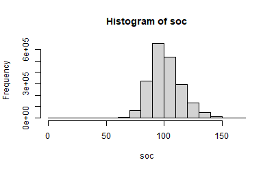

We can also do a sensitivity test to examine how the required sample size changes as we become more or less optimistic about the impacts of our regenerative agricultural practices. The vertical line represents the 10% baseline assumption. For example, if we expect the practices to only increase the SOC by around 5% of the mean, we would need to take >100 samples for each treatment/control. This is because as the effect size diminishes it becomes increasingly difficult to separate the effect from the underlying variability.

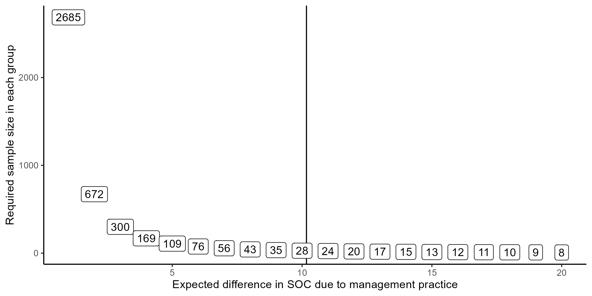

A final note here is that soil quality varies substantially even at local scales, and the pixels used in this analysis obscure this local variability. It is thus a somewhat inappropriate spatial scale at which to do this analysis. In reality, we would likely be working with farmers in a specific area within the North Island, so we would need to characterise the soil variability at more local scales than what I've done in this analysis.

### Extra task: Climate risk analysis
**Rationale:** Soil organic matter can help to improve water retention in soils. This "co-benefit" of regenerative agriculture is particularly important in drought-prone areas, where water availability can be a key limiting factor for crop (/grass/tree) growth. Regions that have low levels of soil organic carbon AND high climate variability are therefore particularly at risk, as water availability is variable and the soil's retention capacity is lower. These regions are therefore potentially prime candidates for adopting regenerative agriculture practices.

**Overview:** In this small analysis, I create a simple climate risk indicator and use this, in conjunction with the data on SOC, to identify at-risk areas in the North Island.

**Approach:** 
1. For each pixel, I calculate a climate risk indicator that represents the variability in annual rainfall. The rationale is that regions with higher rainfall variability are more at-risk to annual fluctuations in rainfall and could therefore potentially benefit from their soil's water-retention capacity. To calculate the rainfall variability, I (a) sum the monthly rainfall over each year and then (b) calculate the standard deviation across each pixel's annual rainfall values.
2. I then consider the climate variability in conjunction with SOC. I classify each pixel into one of three groups: (a) relatively high risk, if SOC is in the bottom third of the distribution (i.e., the lower tertile) AND rainfall variability in the upper tertile; (b) relatively low risk, if the SOC is in the upper tertile AND rainfall variability is in the lower tertile; and (c) moderate otherwise.

**Results:** First, we see that the North Island as a whole has moderate inter-annual rainfall variability -- i.e., there are some wetter years and some drier years.

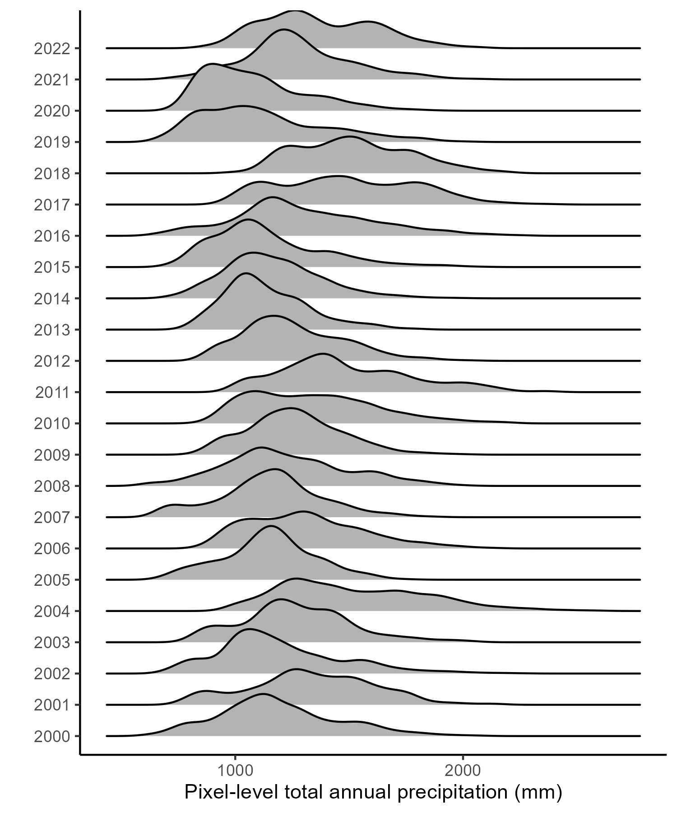

At the pixel-level, there is also a relatively wide distribution of variance -- i.e., some pixels experience much more variable rainfall patterns than others.

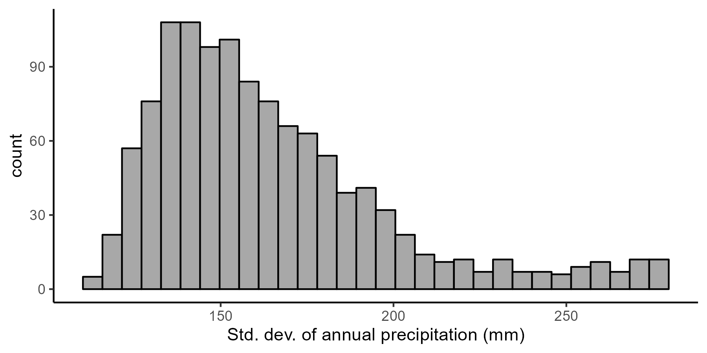

Putting this together with the SOM, we can classify pixels into the three categories of relative risk based on their values relative to the others. Clearly this categorisation is relatively crude, as it does not follow natural breakpoints or clusters in the data.

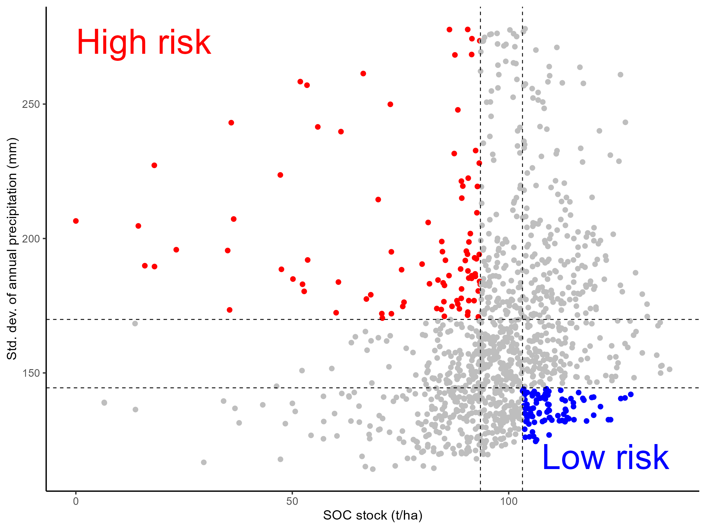

But proceeding with this simple classification, we can map the at-risk pixels. We see clusters of at-risk pixels in the upper North Island, as well as the in the central North Island and some other coastal areas. 

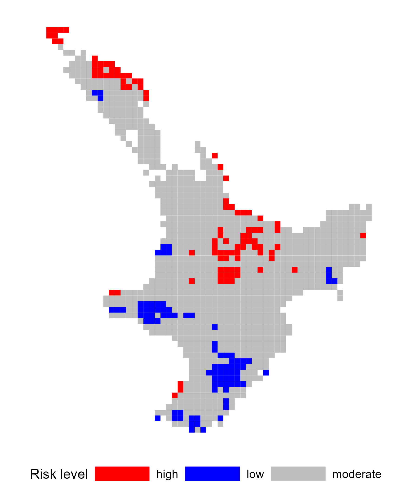

**Concluding thoughts:** While this final analysis was very simple, it is clear that these kinds of assessments could be useful for policymakers or companies like Climate Farmers when considering the potential impact of their interventions, for instance helping to identify regions to target.

## Next steps
Clearly, some caveats remain after spending such a short time on this analysis. If I were to have more time, I would first spend it on the following activities:
- Data quality checking. Some landcover pixels had values that did not fit within the classification categories. I manually fixed these, but this was not based on any other data. There are also certainly national soil and climate datasets that would be more accurate (i.e., less biased) for this particular region, as well as observational data against which to validate the satellite data.
- Conduct analyses (e.g., sample size calculations) for each landcover class separately, as they had distinct SOC distributions.
- Try to refine the land-based representation. The landcover classes are relatively coarse, and with national-level datasets we would likely be able to examine more specific land use categories that are relevant for agricultural management.

Thanks for reading!